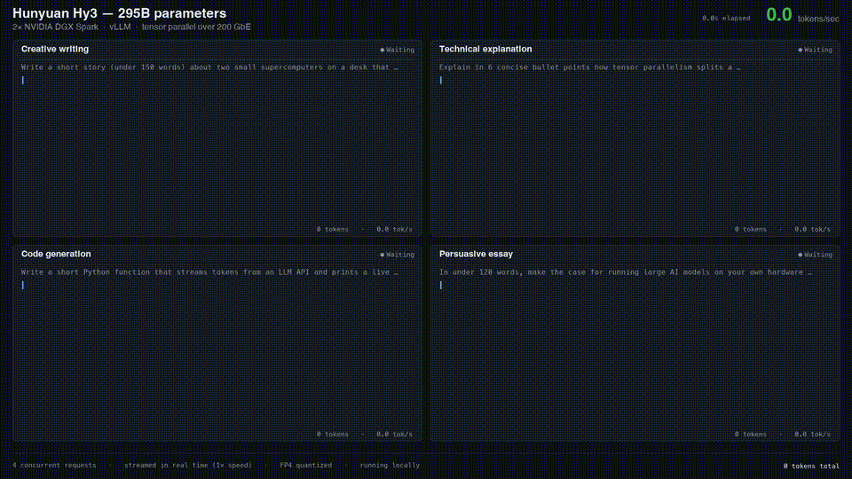

# Hy3-295B · NVFP4 · 2× NVIDIA DGX Spark

Serve **Tencent Hunyuan 3 (295B MoE, 21B active)** across two DGX Spark (GB10) nodes with vLLM + Ray — tuned, benchmarked, and documented decision-by-decision.



*Four concurrent prompts streaming live at 1× speed — [full video](https://github.com/joeynyc/Hy3-295B-NVFP4-2x-DGX-Spark/releases/download/v1.0.0/hy3-quad-stream-pro.mp4).*

**Measured on this exact setup** (not projected):

| Metric | Result |
|---|---|
| Single-stream decode | **~26 tok/s** end-to-end¹ |
| 4 concurrent streams | **60 tok/s aggregate** (15 tok/s each) |
| Context window | **262,144 tokens** (model's native max) |
| KV cache pool | **~414K tokens** (TurboQuant 8-bit K / 4-bit V) |
| Decode at 191K-token depth | 9.4 tok/s (memory-bandwidth bound, fully resident) |
| Prefill | ~500 tok/s |
| Time to first token (short prompt) | ~350–450 ms |
| Cold model load | ~10 min |

¹ *Conservative methodology: our benchmark divides 200 completion tokens by total wall-clock **including prefill and TTFT**. Pure decode rate (tokens ÷ generation time, as most tools report) measures 28–30 tok/s on this setup. Reproduce with `scripts/hy3ctl bench` — run twice, first is warmup.*

Every number here was benchmarked on 2× DGX Spark connected over 200 GbE RoCE. See [docs/FINDINGS.md](docs/FINDINGS.md) for the full experimental log — including the configurations we tested and **rejected**, with data.

> 🤖 **Running an AI agent against this repo or cluster?** Point it at [AGENTS.md](AGENTS.md) — a machine-oriented runbook with health checks, benchmarks, restart procedures, and failure signatures.

---

## Why these settings (the 30-second version)

Everything in the default profile is the *winner* of a measured A/B:

- **TP=2, not PP=2** — pipeline parallel benched 16% slower for single-stream (12.1 vs 14.4 tok/s under identical conditions).
- **TurboQuant `k8v4` KV cache, not fp8** — same decode speed, 33% more KV capacity (414K vs 310K tokens). Quality-checked (exact 6-digit arithmetic, factual recall, tool calls).
- **No MTP speculative decoding** — we got it *working* (see [our upstream PR](https://github.com/vllm-project/vllm/pull/47792)) and then measured it **20% slower** across two nodes: the draft pass pays a second cross-node allreduce per step, which eats the ~1.7× acceptance gain. Single-node setups may differ; on dual Spark, leave it off.
- **CUDA graphs on** (no `--enforce-eager`) — eager mode costs real decode speed.
- **Jumbo frames (MTU 9000) on the cluster rails** — no effect on batch-1 decode (latency-bound), but improves prefill/batch and costs nothing.
- **fp32 router bias** — mainline vLLM silently downcasts Hy3's expert-selection bias to bf16 ([vllm#47777](https://github.com/vllm-project/vllm/issues/47777)); `mods/fix-hy3-expert-bias-fp32.sh` restores checkpoint-accurate expert routing.
- **`nvfp4` KV cache does NOT work on Spark** — it is hard-gated to `sm100f` (B200-class). GB10 is sm121. TurboQuant is the mainline sub-8-bit KV path that actually runs on this hardware.
- **Never use `--load-format fastsafetensors` for this model** — its pinned staging doubles the ~80 GB/node weight footprint during load and OOMs the 121 GB unified memory (took the worker node down hard, twice).

## Hardware & topology

```
┌────────────────────────┐  200 GbE RoCE (QSFP, MTU 9000)  ┌────────────────────────┐
│  DGX Spark  (head)     │◄───────────────────────────────►│  DGX Spark  (worker)   │
│  GB10 · 121 GB unified │   10.100.112.1 ↔ 10.100.112.2   │  GB10 · 121 GB unified │
│  Ray head + vLLM API   │      (dual rail supported)      │  Ray worker (TP rank 1)│
│  ~80 GB weights (TP0)  │                                 │  ~80 GB weights (TP1)  │
└────────────────────────┘                                 └────────────────────────┘
```

- Model weights: ~158 GB NVFP4 (compressed-tensors `nvfp4-pack-quantized`), split by tensor parallelism.
- OpenAI-compatible API on the head node, port 8000.

## Quick start

### Prerequisites (both nodes)

- 2× DGX Spark linked over the 200 GbE fabric, cluster IPs reachable (e.g. `10.100.112.1` ↔ `10.100.112.2`)
- Docker with GPU support, passwordless SSH head → worker
- A vLLM image with GB10 (sbsa/CUDA 13) support and `HYV3ForCausalLM` registered — build one with [NVIDIA's spark-vllm-docker playbook](https://github.com/NVIDIA/dgx-spark-playbooks) (what we run), or try `nvcr.io/nvidia/vllm:26.06-py3` (public, arm64, ships HYV3 + TurboQuant; not the image our benchmarks used)
- The model on both nodes at the same path (default `~/models/Hy3-NVFP4`)
- ~180 GB free disk per node

### Configure & launch

```bash
git clone https://github.com/joeynyc/Hy3-295B-NVFP4-2x-DGX-Spark.git
cd Hy3-295B-NVFP4-2x-DGX-Spark
# edit the config block at the top of start.sh (IPs, image, model path)
./start.sh              # containers on both nodes → Ray → mods → vLLM → wait → bench
```

`start.sh` finishes by printing a live tok/s benchmark. Stop everything with `./stop.sh`.

### One-time: persist jumbo frames (recommended)

```bash
sudo ./scripts/set-cluster-mtu-9000.sh          # on head
ssh <worker> sudo ./scripts/set-cluster-mtu-9000.sh --local
```

### Talk to it

```bash
./scripts/hy3ctl status      # API, Ray nodes, memory/swap both nodes, MTU
./scripts/hy3ctl bench       # 200-token deterministic benchmark (run twice; first is warmup)
./scripts/hy3chat            # streaming terminal chat with per-reply tok/s stats
```

`hy3chat` shows a stats footer after every reply:

```
└─ 342 tok (61% thinking) · 26.3 tok/s · ttft 428 ms · total 13.4s · prompt 52 tok
```

## Serve profiles

| Profile | Context | KV dtype | max seqs | Use case |
|---|---|---|---|---|
| `profiles/hy3-nvfp4-tp2-256k-tq.sh` **(default)** | 256K | turboquant_k8v4 | 2 | Single-user chat, long documents, agents |
| `profiles/hy3-nvfp4-tp2-tuned.sh` | 64K | fp8_e4m3 | 4 | Multi-user / concurrent agent traffic |
| `profiles/hy3-nvfp4-pp2-tuned.sh` | 64K | fp8_e4m3 | 2 | PP=2 reference (16% slower — kept for reproducibility) |

Swap profiles by editing `PROFILE=` in `start.sh` and re-running.

## Tool calling & agent harnesses

Tool calls and reasoning both work out of the box (`--tool-call-parser hy_v3 --reasoning-parser hy_v3 --enable-auto-tool-choice`) — verified with clean `finish_reason: tool_calls` round-trips.

Two things every OpenAI-compatible client should set:

```jsonc
// Hy3 defaults to Chinese without a system prompt, and to thinking-off
// unless the template kwarg is passed.
{
  "messages": [{"role": "system", "content": "Respond in the user's language."}, ...],
  "chat_template_kwargs": {"enable_thinking": true}   // or false for fast, terse replies
}
```

For long-running agents: prefix caching is enabled, so a stable system prompt makes every turn after the first start fast.

## Known sharp edges

| Symptom | Cause / fix |
|---|---|
| First benchmark after a restart is ~4× slow | Warmup. Bench twice. |
| Throughput degrades to ~half after heavy model swapping | Unified-memory pressure (check swap in `hy3ctl status`). Reboot both nodes restores it — we measured 14 → 27 tok/s from exactly this. |
| Worker drops from Ray ("missing too many heartbeats") | Usually an OOM on the worker. `hy3ctl status` shows memory; see AGENTS.md for the rejoin one-liner. |
| Relaunch OOMs the worker | You restarted before the previous run's 80 GB of weights were freed. `start.sh` waits for release; if doing it by hand, watch `free -g` on both nodes first. |
| Reboot loses the serving stack | Containers are `--rm` by design. Run `./start.sh` again. MTU persists via netplan; container-level mods reapply automatically. |
| `earlyoom` kills vLLM/Ray under memory pressure | Stock DGX Spark ships earlyoom preferring to kill inference processes. Check `systemctl is-active earlyoom`; disable or move vllm/ray to its `--avoid` list. |

## Upstream contributions from this work

- [vllm#47792](https://github.com/vllm-project/vllm/pull/47792) — fix `hy_v3_mtp` draft model failing to load NVFP4-quantized `eh_proj` (bare `nn.Linear` → quant-aware `ReplicatedLinear`)
- [vllm#47777](https://github.com/vllm-project/vllm/issues/47777) — Hy3 router `expert_bias` silently downcast from fp32 (local mod in `mods/` until fixed upstream)

## Credits

- [NVIDIA spark-vllm-docker playbook](https://github.com/NVIDIA/dgx-spark-playbooks) — container build + cluster launcher foundation
- Tencent Hunyuan team — the model; vLLM project — the engine
- [MiaAI-Lab/Hy3-Dual-DGX-Spark](https://github.com/MiaAI-Lab/Hy3-Dual-DGX-Spark) — parallel effort on the same problem; their README first documented the DGX Spark `earlyoom` trap
- The dual-Spark community on X for the running head-to-heads that keep everyone honest

## License

MIT
